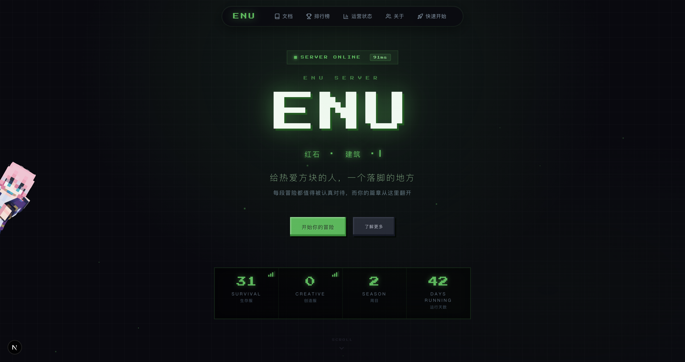
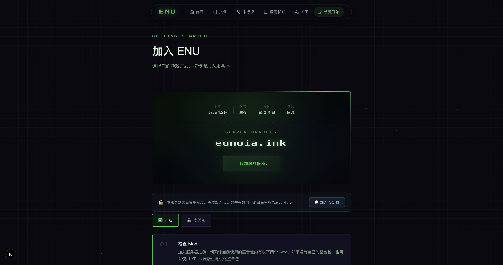
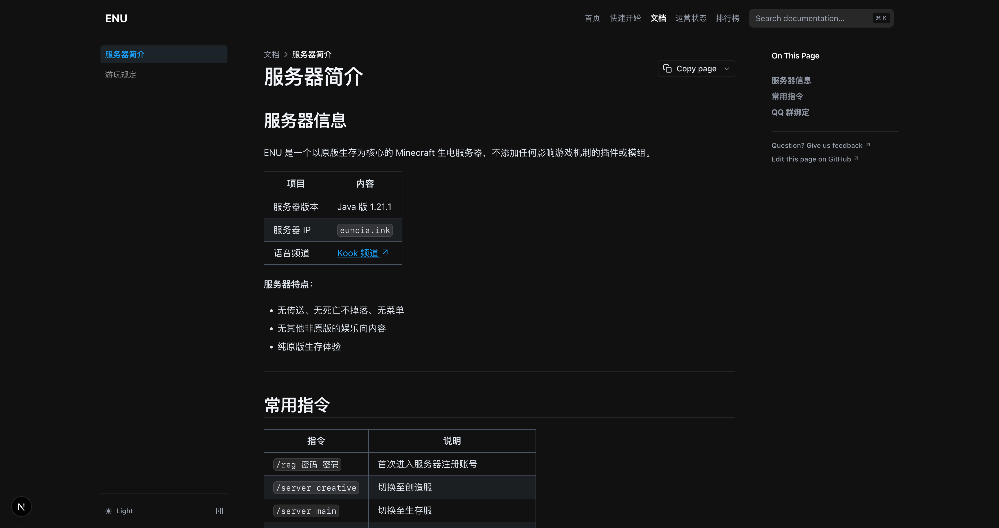
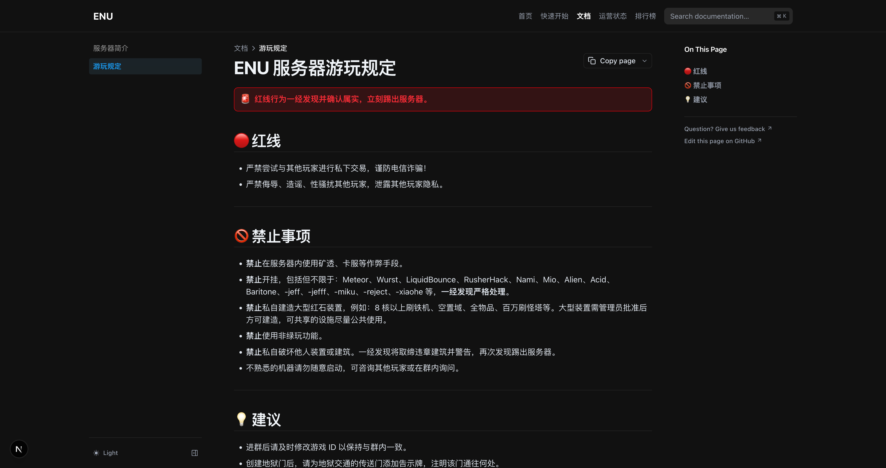
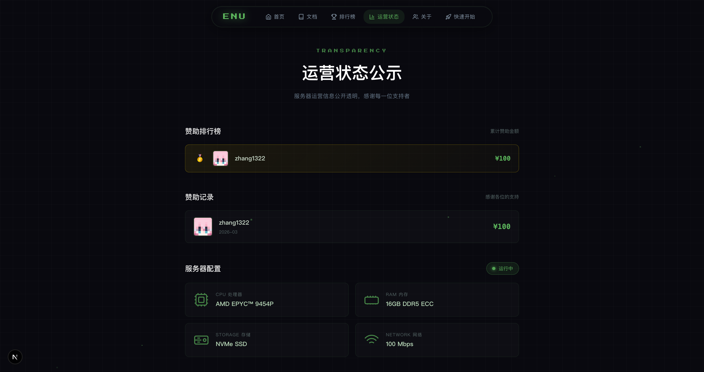
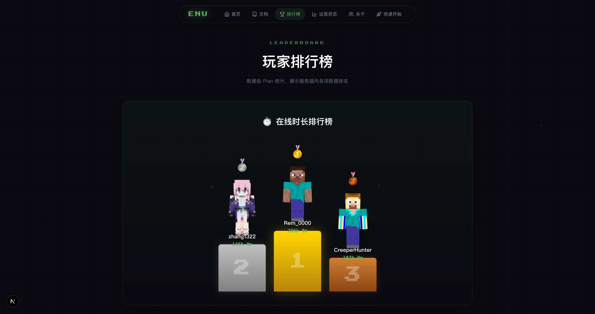
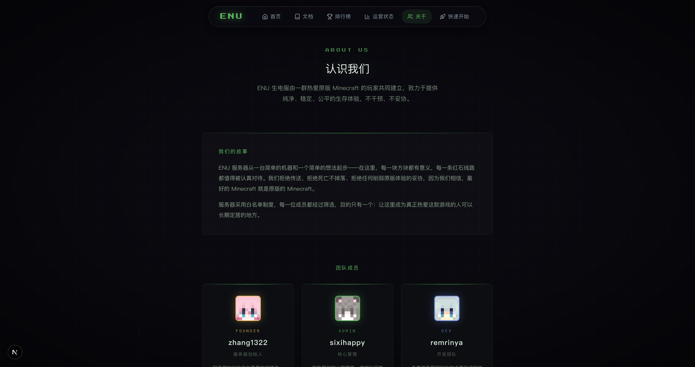

<div align="center">

# EUN Website

**EUN Minecraft 服务器官网**

基于 Next.js + Nextra 构建的 MC 风格服务器官网，包含首页、快速开始指南与文档站。

[](https://nextjs.org/)
[](https://nextra.site/)
[](https://react.dev/)
[](https://www.typescriptlang.org/)
[](https://www.docker.com/)
[](LICENSE)

🔗 **预览：[eun.remrin.dev](https://eun.remrin.dev)**

</div>

---

## ✨ 功能

- 🎮 MC 风格首页，实时显示服务器在线状态、玩家数与延迟
- 🧍 随机展示团队成员 3D 皮肤模型，头部跟随鼠标视线转动
- ⌨️ Hero 区打字机动效，粒子上升背景
- 📊 排行榜页面，含各维度统计与 3D 玩家皮肤预览
- 💰 财务透明页，展示赞助与支出记录，数字滚动计数动画
- 🚀 快速开始页面，覆盖正版与离线版加入流程
- 📋 服务器规则展示
- 📚 文档站（Nextra 驱动，默认暗色模式），支持 MDX 编写文档页面
- ⚙️ 纯 TypeScript 配置，零环境变量依赖

---

## ⚙️ 配置

所有配置均通过 `config/` 目录下的 TypeScript 文件管理，**支持注释，无需环境变量**，修改后重新构建即可生效。

| 文件 | 负责页面 | 说明 |
|------|----------|------|
| `config/home.ts` | 首页 | 打字机文字、特性卡片、画廊、开服日期、服务器列表（支持多个，各自独立域名/端口） |
| `config/getting-started.ts` | 快速开始 | 服务器连接地址、版本/模式/周目、QQ 群链接、Mod 列表、规则 |
| `config/team.ts` | About | 团队成员与核心玩家列表 |
| `config/hardware.ts` | 首页基础设施区块 | 硬件规格卡片、大数字统计 |
| `config/finance.ts` | 财务页面 | 赞助记录与支出记录 |

---

## 🚀 快速开始

### 环境要求

- Node.js 18+
- npm 9+

### 本地开发

```bash
git clone https://github.com/xgenya/eun-website.git
cd eun-website
npm install
npm run dev
```

访问 [http://localhost:3000](http://localhost:3000)

---

## 📦 生产部署

### 方式一：Docker（推荐）


```bash
# 下载 docker-compose.yml
curl -O https://raw.githubusercontent.com/xgenya/eun-website/master/docker-compose.yml

# 启动
docker compose up -d
```

**更新镜像：**

```bash
docker compose pull && docker compose up -d
```


### 方式二：Node.js 直接部署

```bash
git clone https://github.com/xgenya/eun-website.git
cd eun-website
npm install && npm run build

# 用 PM2 守护进程
npm install -g pm2
pm2 start npm --name "eun-website" -- start
pm2 save && pm2 startup
```

### 反向代理（Nginx / 1Panel）

新建站点 → 类型选「反向代理」→ 代理地址填 `http://127.0.0.1:3000` → 绑定域名 → 申请 SSL。

---

## 📁 项目结构

```
eun-website/
├── config/                    # 站点配置（TypeScript，支持注释）
│   ├── home.ts                # 首页（含服务器列表）
│   ├── getting-started.ts     # 快速开始
│   ├── team.ts                # 团队成员
│   ├── hardware.ts            # 硬件规格
│   └── finance.ts             # 赞助与支出
├── content/                   # 页面内容（MDX）
│   ├── index.mdx
│   ├── getting-started.mdx
│   └── docs/
├── src/
│   ├── app/                   # Next.js App Router
│   │   ├── layout.tsx
│   │   └── api/server-status/ # 服务器状态 API
│   └── components/            # React 组件
├── public/                    # 静态资源
├── Dockerfile
├── docker-compose.yml
└── next.config.mjs
```

---

## 页面预览

下列图片使用固定显示宽度；需要查看原始分辨率可直接打开对应 PNG 文件。

### 首页 `/`



### 快速开始 `/getting-started`



### 文档 `/docs`



### 游玩规定 `/docs/rules`



### 运营状态 `/status`



### 排行榜 `/leaderboard`



### 关于 `/about`



---

<div align="center">

Made with ❤️ for EUN Minecraft Server

</div>

